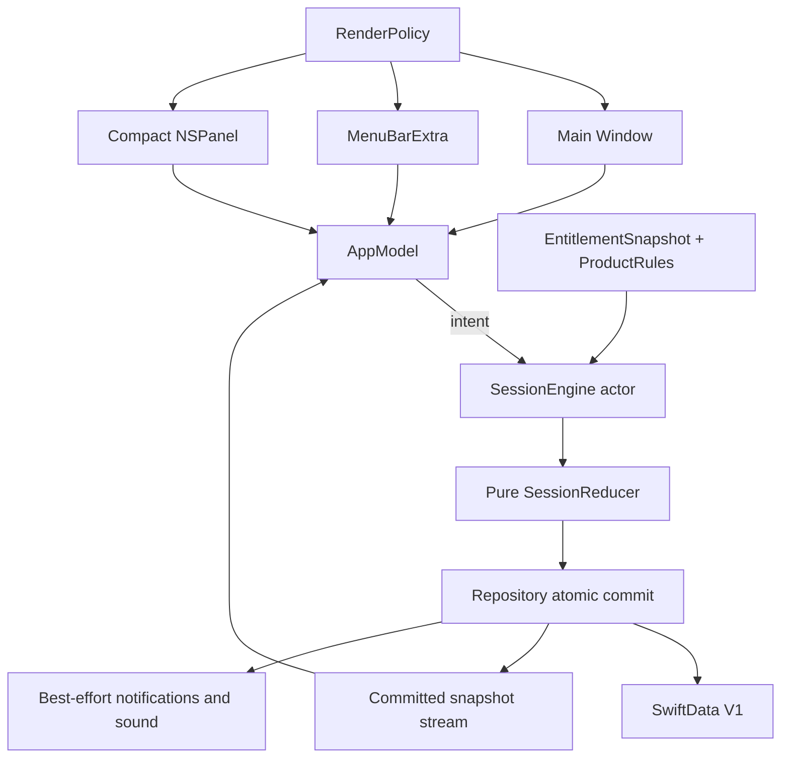

# Praxodoro Native App Blueprint

This expands `SPEC.md` and the active OpenSpec change into implementation boundaries, sequences, errors, tests, and rollback. If this file conflicts with `SPEC.md` or a capability spec, the stricter user-visible requirement wins and the conflict must be logged before implementation.

## Traceability map

| Contract area | OpenSpec capability | Task groups |
|---|---|---|
| S-* workflow | `macos-app-delivery` | 1, 8 |
| E-* session engine | `focus-session-engine` | 3, 4, 5 |
| C-* coach | `adhd-aware-coach` | 3, 5, 6 |
| G-* editions | `edition-capabilities` | 2 |
| U-* UI/accessibility | `liquid-instrument-experience` | 5, 7 |
| P-* privacy/data | `local-data-control` | 4, 6, 7 |
| D-* delivery | `macos-app-delivery` | 1, 7, 8 |

## Runtime topology



No view may own a domain timer, mutate SwiftData directly, or infer entitlement from visibility.

## File ownership

### `PraxodoroCore`

- `SessionState.swift`: immutable state and nested plan/phase/review value types.
- `SessionIntent.swift`: complete user/system command vocabulary.
- `SessionEvent.swift`: versioned factual timeline events; no diagnostic interpretation.
- `TimingPolicy.swift`: Gentle Start, Classic, Flow, Recovery First data and invariants.
- `SessionReducer.swift`: pure transition function with explicit rejection.
- `SessionProjection.swift`: displayed elapsed/remaining projection and review totals.
- `CoachSuggestion.swift`: deterministic suggestions plus explicit reason inputs.
- `SessionTimeSource.swift`: wall + monotonic time abstractions and manual fixtures.
- `PhaseEndScheduling.swift`: exactly-one cancellable deadline request.
- `SessionRepository.swift`: expected-revision atomic commit contract.
- `SessionEngine.swift`: actor serialization, commit, snapshot stream, effect handoff.
- `ProductCapability.swift`: registry and metadata.
- `EntitlementSnapshot.swift`: evidence, expiry, limits, managed/user policy values.
- `ProductRules.swift`: capability resolution and downgrade rules.

### App target

- `AppContainer.swift`: composition root; creates one engine, repository, entitlements, clocks, notification adapter, render-policy sources.
- `AppModel.swift`: main-actor snapshot projection and intent façade; contains no domain transition logic.
- `FocusLoop/*View.swift`: semantic native screens, each a projection of `AppModel`.
- `Scenes/*`: main, menu-bar, and compact adapters over the same model.
- `DesignSystem/*`: tokens, surface roles, render policy, timer instrument, ambient renderer.
- `Persistence/*`: SwiftData models/adapter, retention, export/delete.
- `Platform/*`: notification and power/accessibility monitors.

## Core type contracts

```swift
public protocol SessionRunning: Sendable {
    func snapshots() -> AsyncStream<SessionSnapshot>
    func send(_ intent: SessionIntent) async throws -> SessionResult
}

public protocol SessionRepository: Sendable {
    func loadActive() async throws -> SessionSnapshot?
    func commit(
        expectedRevision: UInt64,
        snapshot: SessionSnapshot,
        events: [SessionEvent]
    ) async throws
}

public struct Reduction: Sendable, Equatable {
    public let snapshot: SessionSnapshot
    public let events: [SessionEvent]
    public let effects: [SessionEffect]
}

public enum SessionReducer {
    public static func reduce(
        snapshot: SessionSnapshot,
        intent: SessionIntent,
        now: SessionInstant,
        capabilities: Set<ProductCapability>
    ) throws -> Reduction
}
```

`SessionResult` returns committed snapshot revision plus effect-status summaries. An effect failure never changes the committed revision.

## State and sequence table

| Current state | Intent/event | Next state | Required event | Reject/edge behavior |
|---|---|---|---|---|
| idle | prepare | prepared | `.sessionPrepared` | empty task remains prepared but cannot start |
| prepared | start | focusing | `.sessionStarted`, `.phaseStarted` | second active record is repository conflict |
| focusing | pause | paused | `.phasePaused` | duplicate pause rejects |
| paused | resume | focusing | `.phaseResumed` | resume uses stored remainder |
| focusing | checkIn | checkingIn | `.checkInOpened` | deadline remains represented in previous state |
| checkingIn | continue | focusing | `.checkInContinued` | explicit resume only |
| checkingIn | makeSmaller | checkingIn | `.actionRevisionRequested` | action must be accepted/edited |
| checkingIn | reportDetour | checkingIn | `.detourReported` | text optional; no passive source |
| checkingIn | requestBreak | breaking | `.breakStarted` | quiet/manual alternative always available |
| breaking | endBreak | prepared/re-entry | `.breakEnded` | no penalty or forced remainder |
| focusing | deadline elapsed | checkingIn/recovery | `.phaseElapsed` | exactly once; never auto-chain after sleep |
| any active | parkThought | same state | `.thoughtParked` | unchanged deadline |
| any active | complete/stop | reviewing | `.sessionReviewStarted` | factual early-stop wording |
| reviewing | finalize | completed | `.sessionCompleted` | raw session-only answers cleaned after commit |
| any | impossible recovered time | recoveryNeeded | `.clockRecoveryNeeded` | user picks safe remainder or review/end |
| active | second start | same + conflict UI | none until choice | Resume, Replace and Review, Cancel |

## Time-correctness matrix

| Situation | Canonical behavior | Test oracle |
|---|---|---|
| Normal countdown | display from monotonic anchor/deadline | zero persistence writes per tick |
| Pause | commit remaining; remove active deadline | time does not advance while paused |
| Resume | new anchors from stored remainder | exactly one deadline task |
| Wall clock +1h in process | monotonic display unchanged; wall deadline rebased | `.clockAdjusted`, same remainder |
| Wall clock -1h in process | same as +1h | no added duration |
| Sleep, wake before deadline | wall deadline remainder | correct single active state |
| Sleep, wake after deadline | one elapsed event; check-in/recovery | no chained phases |
| Relaunch before deadline | UTC reconstruction | same task/action/policy/revision+recovery event |
| Relaunch after deadline | one elapsed/recovery decision | no invented multi-phase history |
| Impossible relaunch value | recovery choices | no silent clamp/complete |
| Duplicate wake/deadline/notification | revision deduplication | one boundary event |
| Flow open-ended | elapsed projection, no deadline | explicit stop/pause only |
| Timezone/DST change | UTC anchors unchanged | no remaining-time jump |

## Coach decision rules

The first implementation uses deterministic, explainable rules only:

1. No capacity → no capacity reason or suggestion.
2. User requests “make smaller” → show editable action field plus deterministic prompt based on the existing task text; do not auto-accept.
3. User explicitly reports restless/overloaded → break suggestions may reference only that report, elapsed focus, and selected policy.
4. Missed/dismissed check-in → mark the event resolved/dismissed; do not increase cadence or add negative state.
5. Fewer than five matching observations across three days → counts only.
6. Eligible observation threshold → descriptive pattern plus sample count/uncertainty; any setting change is separate confirmation.
7. “Drift” never names passive app behavior. UI copy uses “detour,” “paused,” “you asked for help,” or a scheduled event.

## Exact user-facing recovery/error copy

| Condition | Copy | Actions |
|---|---|---|
| Save failure | “Praxodoro couldn’t save that change. Your previous session state is still safe.” | Try Again; Keep Previous State |
| Clock anomaly after relaunch | “Your Mac’s clock changed while Praxodoro was away. Choose what feels accurate.” | Resume with saved remainder; Review this session; End session |
| Second session | “A focus session is already active.” | Resume Current; Replace and Review; Cancel |
| Notification denied | “The timer works without notifications. You can enable private reminders later in System Settings.” | Continue Without; Open Settings |
| Notification scheduling failed | “Your timer is still running, but this reminder could not be scheduled.” | Dismiss; Notification Settings |
| Paid evidence unavailable | “Paid features could not be verified. Your Lite focus tools and local data are still available.” | Continue in Lite; Try Again Later |
| Export failure | “Praxodoro could not finish this export. No source data was changed.” | Try Again; Cancel |
| Partial delete | “Local data was deleted, but {category} still needs deletion confirmation.” | Retry {category}; View details |
| Unsupported transition (debug) | “That action is not available in the current session state.” | Dismiss |

No error uses red failure theatrics, shame, lost points, or urgent purchase language.

## Edition resolution

`ProductRules.resolveProduction(claim:environment:policy:now:)` treats claims as untrusted and,
until a production verifier exists, returns Lite. Internal validated debug/test grants exercise
the same downstream resolver without making production evidence forgeable. Resolution returns:

- unconditional required Lite features
- separately granted and currently available optional capabilities
- capability limits
- policy provenance for each resolved value
- missing authorization/platform/distribution/adapter prerequisites
- next reevaluation time

Fail closed to Lite on unverifiable paid evidence. Do not interrupt active work. Apply paid policy changes at a safe session boundary. The UI may explain unavailable capability outside vulnerable flow states; the engine always enforces it.

Enterprise registry contains no tenant, user-monitoring, productivity-score, task-history, capacity, or check-in export capability.

## Data and retention blueprint

| Category ID | Example fields | Retention | Export | Future sync | Delete All |
|---|---|---|---|---|---|
| `active-session` | task/action/policy/anchors/revision | active + 24h recovery | optional active snapshot | off | yes |
| `task-history` | accepted task/action/status | 30d | yes | separate opt-in | yes |
| `coach-private` | capacity/check-in answers | session-only; optional 30d private history | explicit only | separate opt-in | yes |
| `scratchpad` | thought/interruption text | resolved or session+7d | explicit only | off | yes |
| `session-events` | factual typed events | 30d | yes | separate opt-in | yes |
| `aggregates` | content-free counts/durations | 90d | yes | off | yes |
| `notifications` | event ID/delivery state | until resolved | no | never | cancel/delete |
| `diagnostics` | error class/build/coarse state | off; bounded if opted in | separate support export | separate opt-in | yes |
| `license-config` | signed evidence/managed config | evidence expiry/policy | not user content export | service-specific later | separate reset |

The privacy surface must distinguish local deletion, future sync tombstones, exported files, and device backups.

## UI hierarchy by surface

### Initiate

1. Task field.
2. Editable tiny first action.
3. Optional capacity with no preselection.
4. Four timing presets.
5. Primary Start control.
6. Privacy/support explanation and low-cognitive-load choice.

### Focus

1. Task and next action.
2. Instrument timer (optional in low-cognitive-load mode).
3. Pause/resume.
4. Thought capture.
5. Check-in/break escape.
6. No analytics or commerce takeover.

### Check-in / Break / Re-entry

Use semantic radio/action controls with exposed state. Preserve task orientation. Check-in offers six required actions. Break always offers quiet/alternative/skip/disable and early end. Re-entry restores action before focus resumes.

### Review

Show factual duration, completed/intentional stop, parked thoughts, and counts. Raw session-only capacity/check-ins are removed after the summary unless private history is enabled. No causal claim below threshold.

### Menu bar / Compact

Show task orientation, phase/time, pause/resume, check-in/break escape, and route to full window. Compact surface is optional and user-disableable. Both use the same snapshot/revision.

## Render-policy matrix

| Input | Glass | Ambient | Motion | Boundary | State redundancy |
|---|---|---|---|---|---|
| Default/full | native functional glass | bounded | restrained | semantic | labels + color |
| Reduce Transparency | none/opaque | opaque/static | policy-dependent | stronger | labels + icons |
| Reduce Motion | allowed if transparent setting allows | static | immediate/≤150ms opacity | semantic | labels + icons |
| Increase Contrast | reduced if legibility needs | subdued | unchanged | strongest | labels + icons |
| Differentiate Without Color | unchanged | unchanged | unchanged | semantic | shape/icon/text required |
| Low Power | allowed static | frozen | minimal | semantic | unchanged |
| Hidden | not rendered | stopped | stopped | n/a | n/a |

## Build and generator blueprint

- XcodeGen 2.46.0, MIT, official `yonaskolb/XcodeGen` source, tag commit
  `8445e778451c7e44237b90281bde622d764b0084`.
- Official `xcodegen.zip` SHA-256 is
  `4d9e34b62172d645eed6457cac13fc222569974098ef4ee9c3368bedf0196806`;
  bootstrap installs it under ignored `.build/tools`.
- `project.yml` is the human-readable source; generated `Praxodoro.xcodeproj` is committed.
- Regeneration gate snapshots the entire project directory, runs exact XcodeGen, and recursively
  compares pre/post output. A post-commit gate separately requires clean project/spec paths.
- App bundle identifier: `com.praxodoro.app` for local scaffold unless product signing later chooses a registered identifier.
- Debug builds disable signing in verification commands.
- Core package has no third-party dependencies in the first slice.
- App target uses only Apple SwiftUI, AppKit, SwiftData, UserNotifications, OSLog, and Foundation frameworks in the first slice.

## Verification layers

| Layer | Command/driver | Proves |
|---|---|---|
| OpenSpec | `npm run spec:validate` | spec schema and scenarios |
| Core | `swift test --package-path Packages/PraxodoroCore` | reducer, time, entitlement, engine |
| Format | `xcrun swift-format lint --configuration .swift-format --recursive --strict` over manifest/source/test paths only | bundled Swift 6.3 style/static diagnostics |
| App tests | `xcodebuild ... build-for-testing` then `test-without-building` with retained `.xcresult` | persistence, app model, platform adapters, UI launch |
| Build | `xcodebuild ... build CODE_SIGNING_ALLOWED=NO` | native compilation/link |
| UI/accessibility | XCUITest + VoiceOver identifiers/manual matrix | user-visible navigation/semantics |
| Generator | `scripts/verify-project-generation.sh` | project reproducibility |
| Secret | `gitleaks git --redact --no-banner .` | committed secret patterns |
| Network/privacy | `scripts/verify-zero-network.sh` | no Lite outbound traffic/prohibited entitlement |
| Energy | Instruments/signposts/manual evidence | hidden/reduced/low-power budgets |
| Smoke | `scripts/smoke-app.sh` | isolated `.app` launch and initiation surface |
| Validator | fresh-context spec review | original-criterion coverage/no drift |

No single layer substitutes for another.

## Failure routing

- Compiler/test failure → record red output; debug root cause; never weaken test.
- XcodeGen mismatch → keep committed project, inspect exact generator/version, revert generator experiment if non-deterministic.
- SwiftData failure → keep prior store and in-memory/core evidence; do not publish candidate state.
- Accessibility defect → treat unreachable action/state as Major and fix before surface atom completes.
- Visual regression → compare hierarchy/semantics/fallbacks, not raw browser pixels.
- Privacy/network finding → stop the offending path, remove/justify it, rerun zero-network and secret/entitlement gates.
- Subagent disagreement → resolve using safety, auditability, fail-loud behavior, current product consistency, then simplicity; record rejected option.

## Rollback boundaries

- Each numbered task is a clean commit and can be reverted independently.
- Generated project changes revert with `project.yml` and `Praxodoro.xcodeproj` together.
- Domain core commits precede persistence/UI; later surfaces can be reverted without losing tested state behavior.
- No production/user migration or external service exists in this change. Development fixture stores can be recreated; migration contract tests remain.
- OpenSpec remains unarchived until the final validator passes. A failed implementation leaves planning artifacts intact and tasks unchecked.

## Known unknowns parked outside this change

- Distribution channel, signing identity, App Store product catalog, notarization.
- Exact iCloud schema/migration and StoreKit/Enterprise license infrastructure.
- EventKit/App Intents/Foundation Models adapters.
- Privileged blocker extension distribution and fail-open validation.
- Validated Enterprise buyer workflow beyond local managed privacy/configuration.
- Minor-audience requirements.
