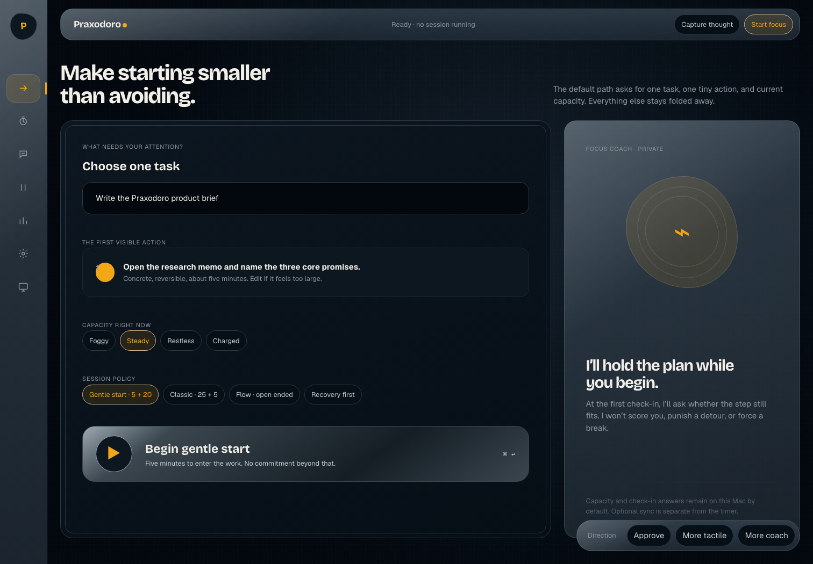
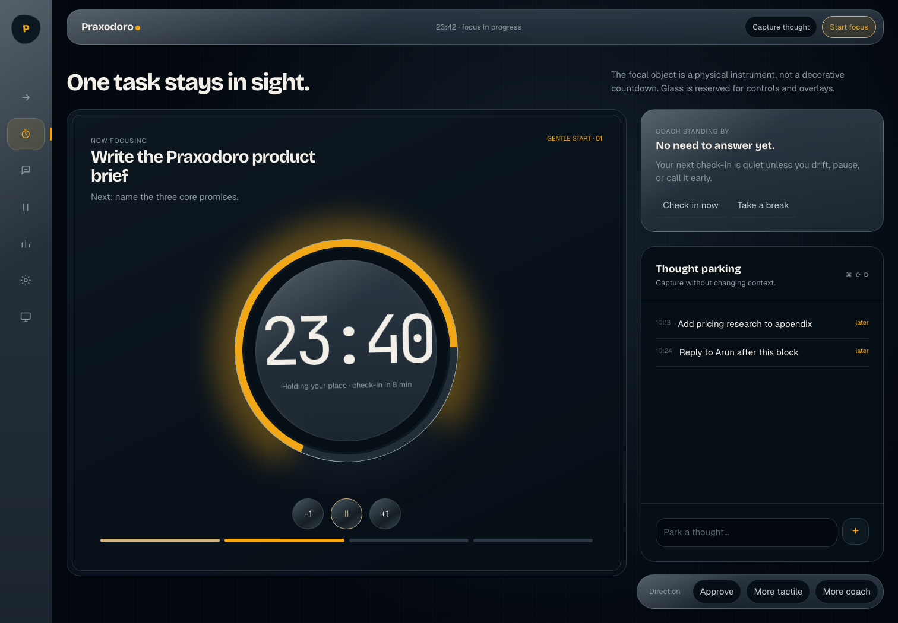
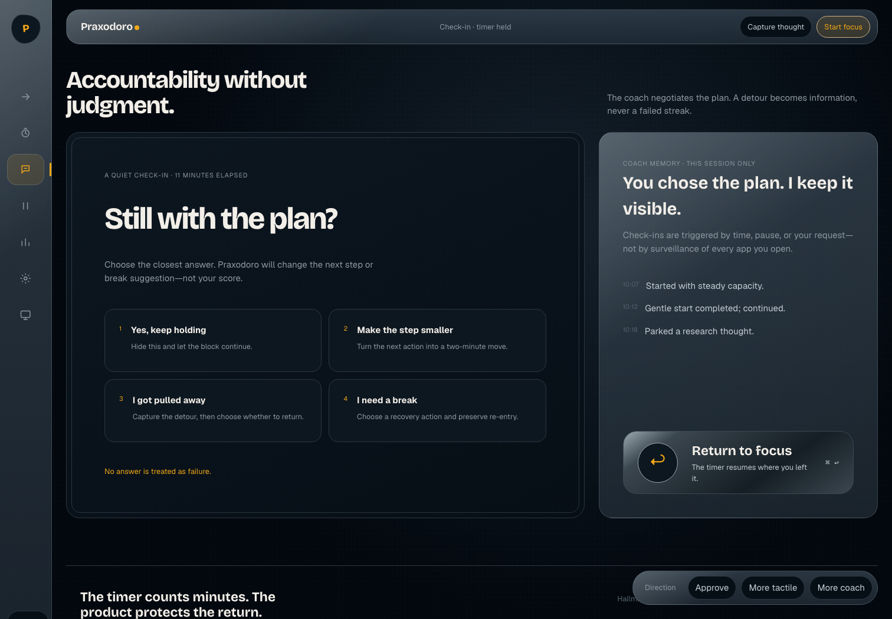
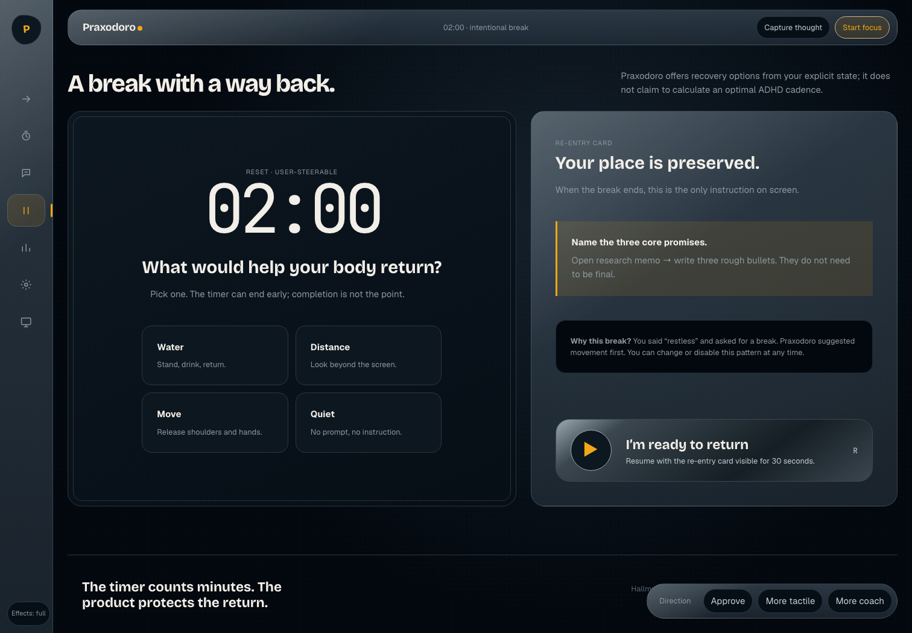
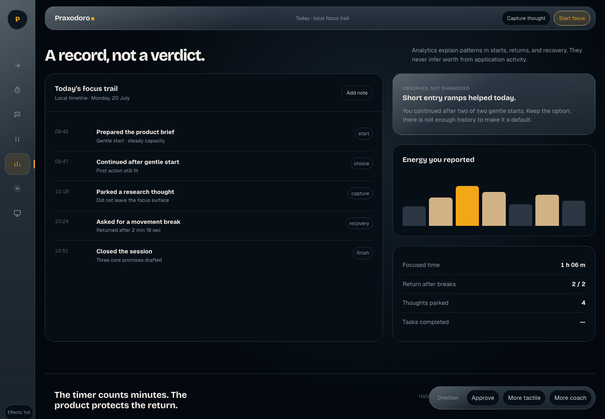
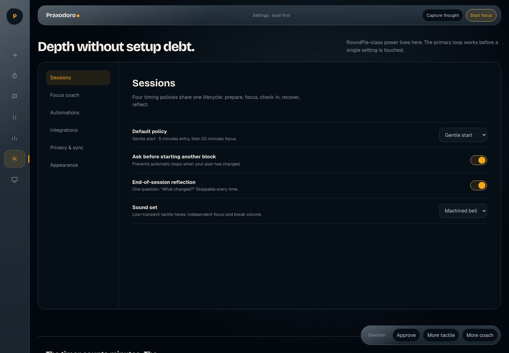
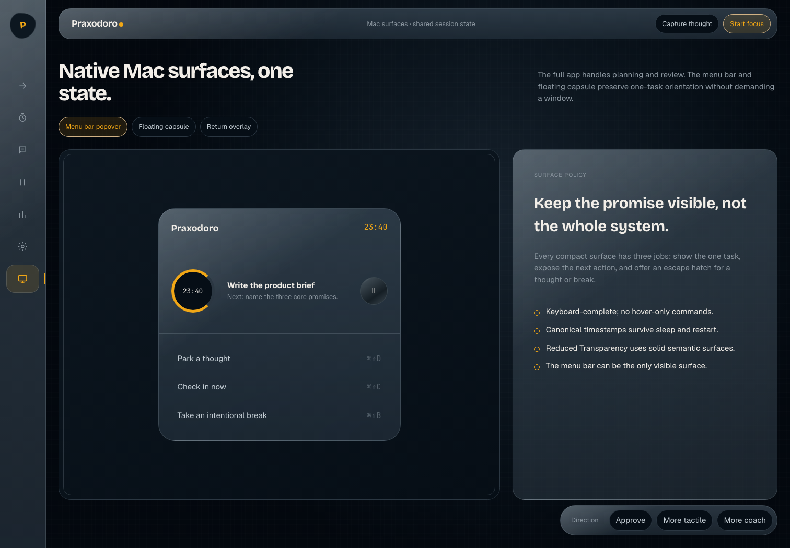

# Praxodoro Hallmark Mock Dossier

Status: **design exploration awaiting user approval**. These are interactive browser mocks, not production macOS code.

The research run behind this direction is fail-closed validated: 53 sources, 38 recorded synthesis claims, 38 supported claims, two evidence waves, and an independent adversarial verification shard.

- [Executive research memo](../../research/pomodoro-landscape-20260720/outputs/executive-memo.md)
- [Technical research report](../../research/pomodoro-landscape-20260720/outputs/technical-report.md)
- [Interactive mock set](./app-mocks.html)
- [Design tokens](./tokens.css)

## Three product and visual approaches

### A. Liquid Instrument — recommended and mocked

A nocturnal, highly crafted Mac instrument: refractive functional controls, machined timer hardware, solid dimensional content panels, and a warm amber signal colour. The ADHD-aware coach appears as an abstract ambient presence rather than a character.

This best balances the brief’s non-minimal visual ambition with low-cognitive-load execution. It can become quieter without losing identity, and it maps cleanly to native SwiftUI, Metal, materials, keyboard commands, menu-bar surfaces, and accessibility alternates.

### B. Living Companion

The coach becomes the visual centre: a larger biomorphic field that changes with initiation, focus, drift, and recovery. It would feel more emotionally supportive and make the ADHD-aware positioning unmistakable.

Trade-off: continuous organic motion can become distracting, feel juvenile, or imply that the coach is clinically interpreting the user. It also creates a harder Reduce Motion and low-power burden.

### C. Focus Observatory

A denser professional control room: session telemetry, calendar context, integrations, automation state, and timelines remain visible around the timer. It would appeal strongly to RoundPie power users and make breadth immediately legible.

Trade-off: it raises activation energy and risks turning the primary focus surface into another dashboard to manage. The strongest elements belong in review and settings, not in the one-task start path.

## Complete mocked flow

### 1. Initiate

One task, one first action, current capacity, and a timing policy. Advanced configuration remains out of the way.

### 2. Focus

The timer is a tactile focal instrument. The task and next action remain visible; the side surface holds only coach status and thought parking.

### 3. Coach check-in

Four nonjudgmental answers preserve agency: continue, make the step smaller, acknowledge a detour, or take a break. There is no failure state.

### 4. Adaptive break

Break suggestions follow explicit user input rather than claiming an objectively optimal cadence. Every break carries a re-entry card.

### 5. Review

The timeline records starts, choices, captures, recovery, and finish state. Insights are descriptive and uncertainty-aware, not diagnostic.

### 6. Settings

RoundPie-class breadth lives behind progressive disclosure: timing policies, coach behavior, deterministic automations, integrations, privacy, sync, blocking experiments, and visual accessibility.

### 7. Native Mac surfaces

The full app supports planning and review. The menu-bar popover, floating capsule, and return overlay preserve the same canonical session state with much less visual weight.

## Interaction coverage

- Screen navigation with keyboard shortcuts `1`–`7`.
- Functional pause/resume and minute adjustment controls.
- One-task initiation with capacity and timing-policy choices.
- Thought parking without leaving focus.
- Check-in and break choices with visible, nonjudgmental state changes.
- Deep settings categories with toggles and opt-in integrations.
- Full and reduced-effects presentation modes.
- Responsive collapse, visible focus rings, reduced-motion behavior, semantic landmarks, and native controls.

## Hallmark assessment

Pre-emit self-critique: Philosophy 5 · Hierarchy 4 · Execution 4 · Specificity 5 · Restraint 3 · Variety 5.

The 58-gate Hallmark review was applied after rendering. The design avoids generic aurora blobs, fake OS traffic lights, feature-card grids, invented performance claims, punitive productivity language, mixed icon libraries, hover-only actions, and unbounded motion. Glass is reserved for functional layers; tactile opaque surfaces carry content.

## Approval boundary

The recommended next decision is whether **Liquid Instrument** is the correct base direction. After approval, the design can be written into the formal product/design specification. Native app implementation remains gated until that written specification is reviewed.
