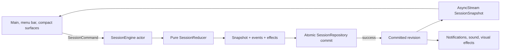
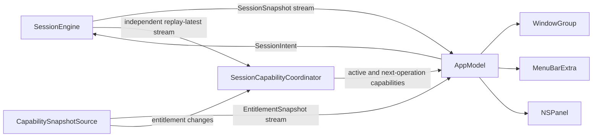

## Context

Praxodoro currently contains a verified native scaffold plus the edition/capability foundation, a two-wave research corpus, and an interactive Hallmark visual dossier. The focus-session domain and product surfaces remain unimplemented. The remaining implementation must turn those artifacts into one local-first macOS product whose main window, menu-bar popover, and compact surface command a single session lifecycle:

```text
prepare → focus → check-in/recover → break/re-enter → reflect
```

The current toolchain is Xcode 26.6, Swift 6.3.3, and macOS 26. The first change targets macOS 26+ so it can use current SwiftUI Liquid Glass APIs with complete accessibility fallbacks instead of maintaining a parallel compatibility renderer.

The latest autonomous implementation request is treated as approval to begin from the “Liquid Instrument” direction. It is not treated as pixel-level approval of every browser value; native QA remains responsible for window sizing, appearances, materials, text, motion, input, and accessibility.

### Visual evidence

| Flow state | Hallmark evidence |
|---|---|
| Initiate |  |
| Focus |  |
| Check-in |  |
| Break |  |
| Review |  |
| Mac surfaces |  |

The full interactive prototype remains at `design-mocks/hallmark/app-mocks.html`. Its JavaScript behavior is not acceptance evidence for the native app.

## Goals / Non-Goals

**Goals:**

- Build the first complete offline Lite vertical slice with one canonical session engine.
- Make sleep, relaunch, clock adjustment, concurrent scenes, and exactly-once boundaries deterministic and testable.
- Keep the UI expressive while making effect policy semantic, accessible, power-aware, and removable.
- Establish capability-set boundaries for future Pro and Enterprise work without separate codebases or speculative SaaS types.
- Keep sensitive data local and bounded by default with explicit category contracts.
- Make project generation, tests, builds, smoke QA, and OpenSpec validation reproducible from a clean checkout.

**Non-Goals:**

- Public distribution, signing, notarization, App Store submission, payments, or a production GitHub remote.
- CloudKit, EventKit, App Intents, Foundation Models, StoreKit, privileged blocking, MDM delivery, or a team backend in the first vertical slice.
- Live cross-device timer control or generalized event-sourced/cloud architecture.
- Screen-per-package layering, VIPER-style pass-through protocols, or a framework-level Redux dependency.
- Diagnostic/clinical claims or passive behavior observation.
- Pixel parity with CSS blur radii, remote fonts, fixed browser dimensions, or dark-only mock assumptions.

## Decisions

### 1. Modular monolith with one deep core package

Use one native app target and one internal Swift package:

```text
Praxodoro/
├── project.yml
├── Praxodoro.xcodeproj/                 # generated and committed; reproducibility checked
├── Packages/PraxodoroCore/
│   ├── Package.swift
│   ├── Sources/PraxodoroCore/
│   │   ├── Session/
│   │   │   ├── SessionState.swift
│   │   │   ├── SessionIntent.swift
│   │   │   ├── SessionEvent.swift
│   │   │   ├── SessionReducer.swift
│   │   │   ├── SessionProjection.swift
│   │   │   ├── TimingPolicy.swift
│   │   │   └── CoachSuggestion.swift
│   │   ├── Runtime/
│   │   │   ├── SessionEngine.swift
│   │   │   ├── SessionRepository.swift
│   │   │   ├── SessionTimeSource.swift
│   │   │   └── PhaseEndScheduling.swift
│   │   └── Entitlements/
│   │       ├── ProductCapability.swift
│   │       ├── EntitlementSnapshot.swift
│   │       └── ProductRules.swift
│   └── Tests/PraxodoroCoreTests/
├── PraxodoroApp/
│   ├── PraxodoroApp.swift
│   ├── App/AppContainer.swift
│   ├── App/AppModel.swift
│   ├── Features/FocusLoop/
│   ├── Scenes/
│   ├── DesignSystem/
│   ├── Persistence/
│   ├── Entitlements/
│   └── Platform/
├── PraxodoroTests/
├── PraxodoroUITests/
└── scripts/
```

The package owns domain truth and can be tested with `swift test`. The app target owns SwiftUI scenes, SwiftData adapter, notifications, effect policy, and macOS integration. Add a new module only after a real second adapter, process, or distribution boundary exists.

**Rejected:** separate Lite/Pro/Enterprise targets or repositories. They would drift, multiply tests, and turn every bug fix into three changes.

**Rejected:** a package for each screen. Screens are projections of one lifecycle, not independent domains.

### 2. Pure reducer inside an actor-isolated engine

The deep runtime interface is:

```swift
public protocol SessionRunning: Sendable {
    func snapshots() async -> AsyncStream<SessionSnapshot>
    func send(_ command: SessionCommand) async throws(SessionEngineFailure) -> SessionResult
}
```

`SessionReducer` is a pure, non-throwing function from snapshot + revision-bearing command + captured
deterministic context to a transition, no-change result, or typed rejection. It does not query
capabilities or platform services. `SessionEngine` is an actor that serializes commands, validates
revisions, commits candidate state/events atomically, publishes the committed snapshot, and then
attempts best-effort effects.



The guarantee is “published means committed.” Notification, sound, or rendering failures cannot roll back or corrupt session truth.

**Rejected:** SwiftData models mutated directly from SwiftUI. It couples persistence, timing, and views and makes sleep/relaunch/concurrent-scene tests unreliable.

**Rejected:** full TCA/Redux at the application level. The reducer benefit is retained inside the deep domain module without a dependency or action ceremony for every view.

### 3. Explicit lifecycle and intent vocabulary

Canonical states and values are closed by `docs/specification/session-domain-contract.md`; the
summary below is routing, not an alternative contract:

```text
idle
prepared(plan)
focusing(phase, anchor, optionalDeadline)
paused(phase, remaining)
checkingIn(previousFocusState)
breaking(breakPlan, anchor, optionalDeadline)
reentering(priorOrientation, proposedAction)
reviewing(summaryDraft)
completed(summary)
recoveryNeeded(reason, safeChoices)
```

The complete SessionIntent enum includes prepare/update, start, pause/resume, typed check-in responses, action acceptance, break selection/end, thought parking, stop/review, active-session conflict resolution, time reconciliation, and clock recovery. It is normative in the session domain contract; there are no additional string commands.

Every state/intent pair gets an explicit transition or typed rejection test from the exhaustive matrix. A second start cannot overwrite an active session; the user chooses Resume Current, Replace and Review, or Cancel. Re-entry is a canonical state so break completion cannot silently resume focus before task/action orientation.

### 4. Timing policy is data

Gentle Start, Classic, Flow, and Recovery First are exact values containing the durations, optional/open-ended semantics, check-in rules, and no-auto-chain transitions in `docs/specification/session-domain-contract.md`. All are Lite because flexible recovery is part of the product’s differentiated support, not an expendable convenience.

Pro later adds saved/custom recipes, triggers, integrations, and deeper analysis—not exclusive access to recovery behavior.

### 5. Wall anchors for recovery, monotonic time for live projection

Persist:

- `startedAt`
- `phaseStartedAt`
- `phaseEndsAt` when timed
- `remainingDuration` when paused
- `stateRevision`
- current policy and phase identifiers

Within a running process, use an injected `ContinuousClock` so manual wall-clock changes do not jump the dial. Persist a wall deadline for crash/relaunch/sleep recovery. If wall and monotonic time diverge during the process, preserve monotonic remaining time, rebase the wall deadline, and append `.clockAdjusted` without blame.

On Mac sleep, timed phases continue. On wake:

- Before deadline: render the correct remainder.
- After deadline: commit one elapsed event and enter check-in/recovery. Never auto-run multiple overdue phases.

After relaunch, reconstruct from UTC anchors. Because trusted external time is intentionally absent,
a finite but contradictory stored/current clock relationship enters `recoveryNeeded` with safe choices
rather than inventing elapsed focus. A non-finite current clock sample is an unavailable measurement,
not relaunch data: it returns the typed zero-write `nonFiniteWallObservation` failure so the caller can
resample without fabricating a timestamped recovery commit.

Use `TimelineView` or a cancellable display task only for redraw. Persist no per-second ticks. The engine owns one injectable deadline task and deduplicates wake/notification/deadline callbacks by state revision.

### 6. SwiftData is an adapter, not the domain

V1 models:

| Record | Purpose |
|---|---|
| `FocusSessionRecord` | Task, accepted action, policy, totals, timestamps, status, content-retention flags |
| `ActiveSessionRecord` | Zero-or-one encoded canonical snapshot, revision, timing anchors |
| `SessionEventRecord` | Session ID, sequence, timestamp, typed versioned payload |
| `ParkedThoughtRecord` | Session link, timestamp, text, resolution state |
| `RetentionStateRecord` | Last cleanup and per-category retry/failure status |

`SessionRepository.commit(expectedRevision:snapshot:events:)` saves the materialized active snapshot and append-only user-visible timeline in one `ModelContext.save()`. The app does not reconstruct every launch from a generalized event store.

Both `InMemorySessionRepository` and `SwiftDataSessionRepository` run the same contract suite. Schema uses `VersionedSchema`; migration failure leaves the prior store recoverable.

**Rejected:** generalized event sourcing and live CloudKit timer synchronization. The product does not need a distributed timer log, and CloudKit is not a real-time control transport.

### 7. Editions resolve to capabilities, permissions, and distribution prerequisites

Keep six independent dimensions:

1. Product capability granted by verified evidence.
2. OS permission or user consent.
3. Platform eligibility such as an iCloud account or supported on-device model.
4. Distribution capability such as a signed system extension.
5. Adapter implementation availability.
6. Current runtime service or model availability.

Views ask `capabilities.contains(.iCloudSync)`; engines independently reject unavailable intents. They never rely on hidden UI as enforcement.

The complete `RequiredLiteFeature` inventory is unconditional and is never fed through a paid
gate. Optional `ProductCapability` descriptors record edition eligibility, authorization,
platform eligibility, distribution, data access, downgrade policy, and adapter availability.
`EntitlementSnapshot` separates granted from currently available optional capabilities and
contains limits, evidence type, verification state, issued/expiry metadata, every simultaneously
missing prerequisite reason,
policy provenance, and next reevaluation. Debug static evidence is visibly non-production.
StoreKit 2 and a signed expiring offline Enterprise license are future adapters; until one exists,
the public production resolver cannot grant paid access, and a UserDefaults Boolean is never
evidence.

Validated grants have private construction and remain valid only while
`issuedAt <= verification-or-resolution-time < expiresAt`. Unverified paid evidence fails closed to
Lite. An active session preserves only an opaque lease derived from its committed session ID/start
revision and complete entitlement snapshot when paid expiry is the sole change. The transition
compares the active commit, full captured snapshot, raw resolution context, resolved policy, and
the next expired snapshot's source/issue/expiry/limits; it derives expiry-only eligibility from the
same validated grant and time rather than treating claim loss, logout, verifier failure, or a
caller-supplied reason as expiry. Authorization, platform, distribution, OS-safety, enforced-privacy, and combined changes
apply immediately. Data remains readable/exportable after downgrade.

Managed-policy precedence is OS safety → enforced managed privacy policy → user choice → recommended managed default → app default. Every managed input belongs to one exhaustive typed schema; diagnostics and sync defaults are structurally fixed off, and recommendations cannot provide consent. Enterprise adds no task/behavior reporting schema.

### 8. One app projection, independent session and capability streams

`AppContainer` owns one `SessionEngine`, one `CapabilitySnapshotSource`, and one `AppModel`.
`AppModel` subscribes independently to a replay-latest broadcast `SessionSnapshot` stream and the
`EntitlementSnapshot` stream, then publishes one combined app projection. A capability-only
change updates product entry points and the Core capability coordinator without fabricating a session event or
changing the current session ID/revision. `WindowGroup`, `MenuBarExtra`, and the later `NSPanel`
compact adapter observe that same app projection and send session intents back to the same actor.
Atom 5.2 also introduces a public Core `SessionCapabilityCoordinator` façade initialized from that
same `SessionRunning` instance. It observes committed start/boundary publications inside Core and
uses Atom 2.2's inaccessible receipt/lease values; the app cannot construct a lease, supply a
downgrade reason, or duplicate the expiry-only transition rule.



First integration order:

1. Main window with Initiate and Focus.
2. Manual Check-in, Break/Re-entry, Review, thought parking.
3. Menu-bar parity.
4. Compact floating surface after Space/fullscreen/focus/VoiceOver QA.

The compact panel is Lite but is deliberately later because AppKit activation and accessibility behavior are riskier than domain/UI composition.

### 9. Semantic Liquid Instrument render policy

`RenderPolicy` derives from:

- Reduce Transparency
- Reduce Motion
- Differentiate Without Color
- Increase Contrast / color-scheme contrast
- Low Power Mode
- app animation-quality override
- scene visibility

Surface roles:

| Role | Use | Full-effects renderer | Fallback |
|---|---|---|---|
| Functional Glass | Navigation, controls, popovers | `.glassEffect`, `GlassEffectContainer` | Opaque semantic control surface |
| Instrument | Timer/status body | Native gradients, Canvas, restrained shadow, optional bounded shader | Opaque dimensional surface |
| Content | Task, history, settings | Semantic opaque/standard material | Same with stronger separation |

Reduce Transparency removes all glass/material, including overlays and dialogs. Reduce Motion removes mesh motion, particles, parallax, morphing, blur animation, and spring overshoot; only immediate/≤150 ms opacity changes remain. Low Power or hidden scenes freeze ambient work. Increased Contrast strengthens borders/focus/text; Differentiate Without Color adds shape/icon/text redundancy.

The timer is one meaningful VoiceOver value and never announces every second. State transitions announce once. Every interaction supports Full Keyboard Access with visible focus.

Use native SF Pro/SF Mono and SF Symbols initially. No Google Font or third-party effects runtime. A future custom font must be bundled with verified license and cannot load from the network.

### 10. Local-first privacy defaults

| Category | Default retention | Sync default |
|---|---|---|
| Active task/action/timer | Session + 24-hour recovery | Off |
| Task/action history | 30 days | Separate future opt-in |
| Capacity/check-in answers | Session-only | Separate future opt-in |
| Scratchpad/interruption notes | Until resolved or seven days after session | Off |
| Raw session events | 30 days | Separate future opt-in |
| Content-free aggregates | 90 days | Off |
| Pending notifications | Until delivered/dismissed/invalidated | Never |
| Diagnostics | Off unless explicit opt-in; bounded/content-free | Separate opt-in |

The Lite baseline contains no code path that requires outbound requests. AI enhancement is out of the first slice; deterministic/manual initiation is canonical. Secrets use Keychain. User content never enters diagnostics.

Delete All enumerates every local category and any future sync tombstone state. It reports partial failure and honestly excludes already exported files and device backups from its direct reach.

### 11. XcodeGen is pinned development tooling

Use XcodeGen 2.46.0 from `https://github.com/yonaskolb/XcodeGen` (MIT) to generate `Praxodoro.xcodeproj` from `project.yml`. It is development-only and not linked into the app. The generated project is committed for easy local/CI builds; regeneration must produce no diff.

The repository bootstraps the exact official release archive into ignored repo-local tooling, verifies the archive SHA-256 before extraction, and verifies the pinned extracted-executable SHA-256 before every invocation, including cached use. Interrupted-download cleanup is confined to the exact repo-local `.download.*` directory created by the bootstrap. Homebrew and ambient PATH installations are not accepted by the generator gate. If XcodeGen becomes unavailable, the committed project remains buildable while a replacement generator decision is made.

### 12. Verification is layered and spec-traceable

Gates:

1. Core reducer/clock/capability tests with manual clocks.
2. Repository contract tests against in-memory and temporary SwiftData.
3. App model and main/menu-bar shared-instance integration tests.
4. Accessibility semantics and alternate-render-policy tests.
5. `xcodebuild` app build and test.
6. Isolated-storage launch smoke.
7. Strict OpenSpec validation, formatting/static checks, dependency/secret scans.
8. Fresh-context validator mapping `SPEC.md` requirements to code and evidence.

Every implementation task records the observed red result before production code, focused green, broader regression, smoke, and commit. `docs/specification/acceptance-trace.md` maps all 57 EARS criteria to their OpenSpec scenarios, owning atoms, validation profiles, and eventual evidence boundary.

## Risks / Trade-offs

- **Sleep behavior may surprise users who expect a paused timer** → state explicitly that timed focus continues through sleep; provide recovery after elapsed sleep and later validate a user setting rather than silently guessing.
- **Post-restart wall-clock anomalies cannot be perfectly resolved offline** → show a recovery choice and preserve audit history instead of claiming certainty.
- **SwiftData isolation can leak into views** → keep models behind repository interfaces and contract-test both adapters.
- **Multiple scenes can race commands** → one actor and expected revisions serialize/deduplicate all transitions.
- **Expressive visuals can become attention traps or burn energy** → semantic effect roles, automatic accessibility/power policy, no hidden continuous renderer, and performance instrumentation.
- **Browser mocks are dark/fixed and contain remote fonts** → semantic light/dark tokens, resizable native layouts, SF typography, hierarchy-based visual review.
- **Floating panel behavior across Spaces/fullscreen/VoiceOver is risky** → ship and prove main/menu-bar first; add panel only after its own UI/accessibility tests.
- **Paid gating could hollow out the differentiated product** → Lite capability matrix is normative and all core recovery/accessibility behavior is contract-tested.
- **“Adaptive” could drift into diagnosis or surveillance** → deterministic explicit-input rules, reason strings, no passive signals, and a privacy test suite.
- **Enterprise abstractions could create surveillance pressure** → scaffold only offline license and managed privacy/config interfaces; forbid personal behavior fields.
- **Committing generated project files can drift from `project.yml`** → pin XcodeGen and make regeneration-diff a gate.

## Migration Plan

This is a greenfield native implementation.

1. Commit proposal/spec/design/task artifacts with no app code.
2. Install and verify XcodeGen 2.46.0; add `project.yml`, app target, package, and empty smoke surface.
3. Build the pure capability and session reducer atoms with red-green tests.
4. Add actor engine/time source/in-memory repository and deterministic clock tests.
5. Add SwiftData V1 adapter and migration/contract tests.
6. Add semantic design system and accessibility render-policy tests.
7. Wire initiation/focus, then check-in/break/re-entry/review, then menu bar, then compact panel.
8. Add isolated launch smoke and CI verification.
9. Run specialist review, design QA, security/privacy scan, performance checks, and fresh-context spec validation.
10. Archive the OpenSpec change only after all accepted tasks are verified.

Rollback is commit-level. Each atom is an independent change. If a scaffold or generator experiment fails, revert that atom and retain the last green core/package state. No user store migration ships in this change; during development, V1 fixture stores can be recreated, while migration tests protect the future boundary.

## Open Questions

Resolved for this change:

- Timed phases continue through Mac sleep; elapsed sleep returns to a user decision instead of auto-chaining.
- macOS 26+ is the initial deployment target.
- Both semantic light and dark appearances are supported; the nocturnal Hallmark character remains the flagship dark treatment.
- All four timing presets and raw data export remain in Lite.
- Main window and menu bar precede the compact panel; all are Lite.
- Capacity/check-in answers are session-only by default.
- Privileged blocking is a separately installed and separately specified add-on, not implied by Enterprise.

Parked for later changes:

- Mac App Store, Developer ID, or dual distribution.
- Exact future iCloud category schema and local-to-cloud migration.
- StoreKit product catalog and Enterprise license issuer/revocation process.
- EventKit/App Intents and Foundation Models adapters.
- System-extension distribution and recovery support commitment.
- Any validated Enterprise buyer workflow beyond offline license and managed privacy/config policy.
